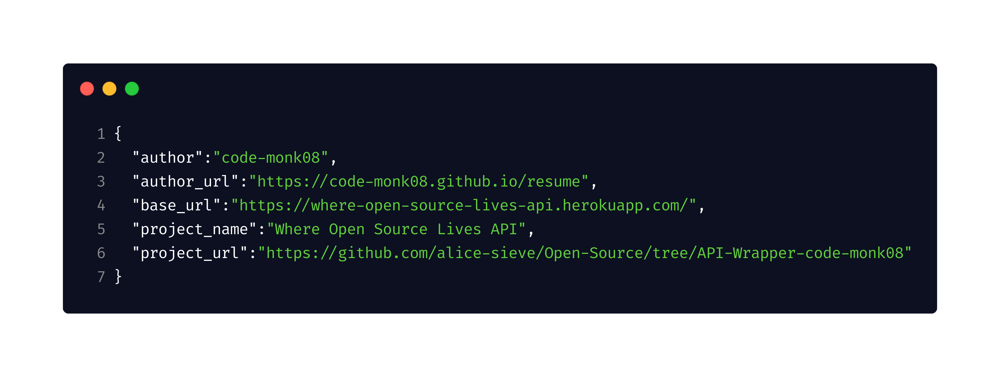

<p align="center">
  
</p>

[](https://github.com/code-monk08/https://github.com/code-monk08/open-source-api-wrapper/issues)  [](https://github.com/code-monk08/https://github.com/code-monk08/open-source-api-wrapper/network/members)  [](https://github.com/code-monk08/https://github.com/code-monk08/open-source-api-wrapper/stargazers)          [](https://twitter.com/intent/follow?screen_name=codemonk08_)  [](https://telegram.me/codemonk08)

## :ledger: Index

- [About](#beginner-about)
- [Usage](#zap-usage)
   - [Installation](#electric_plug-installation)
   - [Commands](#package-commands)
- [File Structure](#file_folder-file-structure)
- [Guideline](#exclamation-guideline)  
- [Resources](#page_facing_up-resources)
- [Gallery](#camera-gallery)
- [Endpoints](#endpoints)
- [Credit/Acknowledgment](#star2-creditacknowledgment)
- [License](#lock-license)

##  :beginner: About
It is a GitHub & GitLab API Wrapper packaged into one server, It was built in Python3 & Flask, It contains minimal API interactions which were implemented to get only the required information from the respective Github & Github APIs, I built this project under [alice-sieve](https://github.com/alice-sieve/Open-Source/tree/API-Wrapper-code-monk08/API%20Wrapper) organization.

## :zap: Usage
To use this project.

###  :electric_plug: Installation
- Install dependencies & export environment variables.

```bash
$ sudo -H pip3 install -r requirements.txt
```
###  :package: Commands
- Start project using
```bash
$ cd src
$ python3 server.py
```

##  :file_folder: File Structure
- Add a file structure here with the basic details about files, below is an example.

```
.
├── LICENSE
├── logo
│   └── api.png
├── Procfile
├── README.md
├── requirements.txt
└── src
    ├── GithubToken.py
    ├── GithubWrapper.py
    ├── GitlabToken.py
    ├── GitlabWrapper.py
    └── server.py                   

2 directories, 10 files
```

##  :exclamation: Guideline

- __Code Style__

### `black`
In order to maintain the code style consistency across entire project I use a code formatter. I kindly suggest you to do the same whenever you push commits to this project. 

The python code formatter I chose is called Black. It is a great tool and it can be installed quickly by running 

```bash
sudo -H pip3 install black
```

or

```bash
python3.6 -m pip install black
```

It requires Python 3.6.0+ to run.

- __Usage__

```bash
black {source_file_or_directory}
```

For more details and available options, please check their [psf/black](https://github.com/psf/black).

### `isort`
I also use isort, it is a Python utility / library to sort imports alphabetically, and automatically separated into sections. It provides a command line utility which can be installed using.

```bash
sudo -H pip3 install isort 
```

- __Usage__

```bash
isort {source_file}.py
```

For more details and available options, please check their [timothycrosley/isort](https://github.com/timothycrosley/isort).


- __Close Issues__

Close issues using keywords: [how to ?](https://help.github.com/en/articles/closing-issues-using-keywords)

##  :page_facing_up: Resources
- [GitHub API Documentation](https://developer.github.com/v3/) : describes the resources that make up the official GitHub REST API v3.
- [GitLab API Documentation](https://docs.gitlab.com/ee/api/) : describes the resources that make up the official GitLab REST API.


##  :camera: Gallery
<p align="center">
  
</p>

## Endpoints

- GET organizations/ group Members
```
  - GET /github/orgs/:org/members
  - GET /gitlab/groups/:id/members
```

- GET organizations repos/ group projects
```
  - GET /github/orgs/:org/repos
  - GET /gitlab/groups/:id/projects
```

- GET repos commits / projects commits
```
  - GET /github/repos/:owner/:repo/commits
  - GET /gitlab/projects/:id/repository/commits
```

- GET repo's issues / projects issues
```
  - GET /github/repos/:owner/:repo/issues
  - GET /gitlab/projects/:id/issues
```

- GET Organization issues / groups issues
```
  - GET /github/orgs/:org/issues
  - GET /gitlab/groups/:id/issues
```

- GET repo issues comments/ project issue comments
```
  - GET /github/repos/:owner/:repo/issues/comments
  - GET /gitlab/projects/:id/issues/:issue_iid/notes
```

- GET repo pull requests / project merge requests
```
  - GET /github/repos/:owner/:repo/pulls
  - GET /gitlab/projects/:id/merge_requests
```

## :star2: Credit/Acknowledgment
[](https://github.com/code-monk08/https://github.com/code-monk08/open-source-api-wrapper/graphs/contributors)

##  :lock: License
[](https://github.com/code-monk08/https://github.com/code-monk08/open-source-api-wrapper/blob/master/LICENSE)
